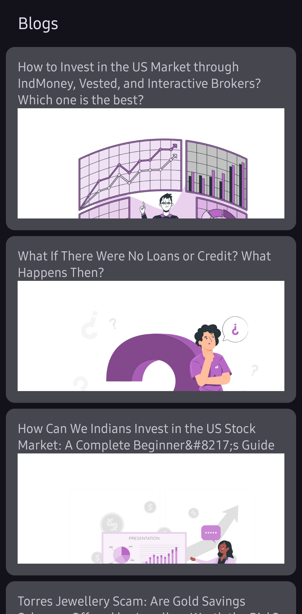
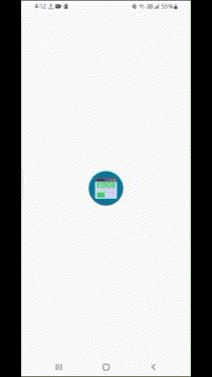

<div style="display: flex; justify-content: space-around; align-items: center;">
  <a href="Screenshot">
    
  </a>
  <a href="ScreenShot">
    
  </a>
    <a href="Gif">
    
  </a>

</div>

# Blog Reading App

A simple Android app that fetches and displays blog posts from an API. Built using Kotlin, Jetpack Compose, Retrofit, and following the MVVM architecture.

## Features

- **Fetch Blog Posts:** Retrieves the latest posts from a REST API endpoint.
- **List View:** Displays posts in a scrollable list with title and a preview of the content.
- **Detail View:** Opens the full post in a WebView for rich HTML rendering.
- **Navigation:** Uses Navigation Compose for smooth screen transitions.
- **Back Navigation:** Handles both the system back button and a top app bar back button.

## Technologies Used

- **Kotlin**
- **Jetpack Compose** for UI
- **Retrofit** with Gson converter for network operations
- **Navigation Compose** for in-app navigation
- **WebView** embedded using AndroidView
- **MVVM Architecture** with a Repository pattern

## Project Structure

```
/blogs
 ├── /model        -> Data layer (API DTOs, Retrofit setup)
 ├── /repository   -> Data sources (Repository classes)
 ├── /viewmodel    -> Business logic (ViewModels)
 ├── /view         -> UI layer (Activities, Composables, Navigation)
 └── /utils        -> Helper functions and extensions
```

- **/model:** Contains data classes (e.g., `BlogPost.kt`, `Guid.kt`, etc.) and the Retrofit API interface (`BlogApiService.kt`) along with the Retrofit instance (`RetrofitInstance.kt`).
- **/repository:** Contains repository classes (e.g., `BlogRepository.kt`) that manage data operations.
- **/viewmodel:** Houses your ViewModels (e.g., `BlogViewModel.kt`) which use the repository to fetch and expose data.
- **/view:** Contains all UI-related code such as activities, composables, and navigation setup (e.g., `BlogListScreen.kt`, `BlogDetailScreen.kt`, `Navigation.kt`).
- **/utils:** For helper functions, extension functions, and other common utilities.

## Setup and Installation

1. **Clone the Repository:**

   ```bash
   git clone https://github.com/pranav5127/Blogs.git
   cd your-project
   ```

2. **Open in Android Studio:**

   Open the project in Android Studio (version 4.2+ recommended) and let Gradle sync.

3. **Configure Build Settings:**

   - Ensure your `minSdkVersion` is set to at least 21.
   - Verify your dependencies in the Gradle files. Key libraries include:
     - Retrofit: `2.9.0`
     - Gson Converter: `2.9.0`
     - AndroidX Lifecycle: `2.8.7`
     - Navigation Compose: `2.8.7`
     - Coil Compose: `2.4.0`
     - AndroidX Webkit: `1.9.0`

4. **Run the App:**

   Connect an Android device or use an emulator and run the project.

## API Configuration

- The base URL is set in `RetrofitInstance.kt`:

   ```kotlin
   Retrofit.Builder()
       .baseUrl("https://blog.vrid.in/wp-json/wp/v2/")
       .addConverterFactory(GsonConverterFactory.create())
       .build()
   ```

- Adjust query parameters (e.g., `per_page` and `page`) in your API service if necessary.

## Usage

- **Blog List Screen:**  
  When you launch the app, the main screen displays a list of blog posts. Each card shows the post title and a preview rendered using a WebView.
  
- **Blog Detail Screen:**  
  Tapping on a post navigates to a detail screen that renders the full post via a WebView. Use the back arrow in the top app bar or the device’s system back button to return.

## Acknowledgments

- [Retrofit](https://square.github.io/retrofit/)
- [Jetpack Compose](https://developer.android.com/jetpack/compose)
- [Android Developers](https://developer.android.com/)

